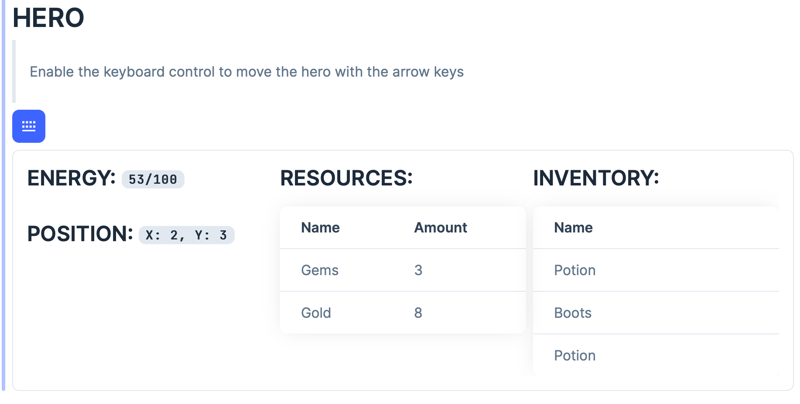
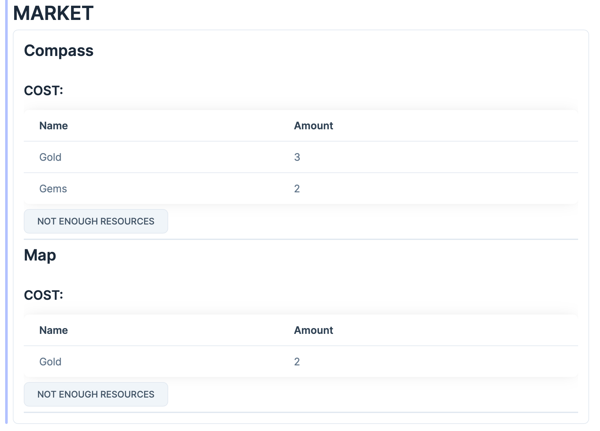

# Ecspanse Demo

This is the code used in the [Ecspanse Tutorial](https://hexdocs.pm/ecspanse/tutorial.html). [Ecspanse](https://hexdocs.pm/ecspanse/Ecspanse.html) is a an [Entity Component System](https://en.wikipedia.org/wiki/Entity_component_system) library for Elixir.

## Installation

- clone the repo
- install dependencies with `mix deps.get`

## Running the API Functions in the IEX Console

- start the app with `iex -S mix`

Then:

- fetch the hero details

```iex
iex(1)> Demo.API.fetch_hero_details()
```

- move the hero

```iex
iex(2)> Demo.API.move_hero(:up)
```

etc. See the functions in the `Demo.API` module for more details.

## Running the Demo in LiveBook

- you need to have elixir [LiveBook](https://livebook.dev/) installed
- start the livebook
- start the Demo ap with the `sname` and `cookeie` options, like: `iex --sname demo  --cookie cookie -S mix`

- open the livebook

  - open
  - from file
  - browse to `./ecspanse_demo/livebook/`
  - select `demo.livemd`
  - open

- connect the livebook to the running demo app
  - in the left menu select the `Runtime settings`
  - configure
  - attach node
  - add the `name` and `cookie` you set when starting the demo app
  - connect
- the app should be now connected and you can evaluate the code in the livebook
- the two sections should be available: Hero and Market. Enable the keyboard control and use the arrow keys to move the hero and collect resources. Use the resources to purchase items from the shop and see them in the hero inventory.



